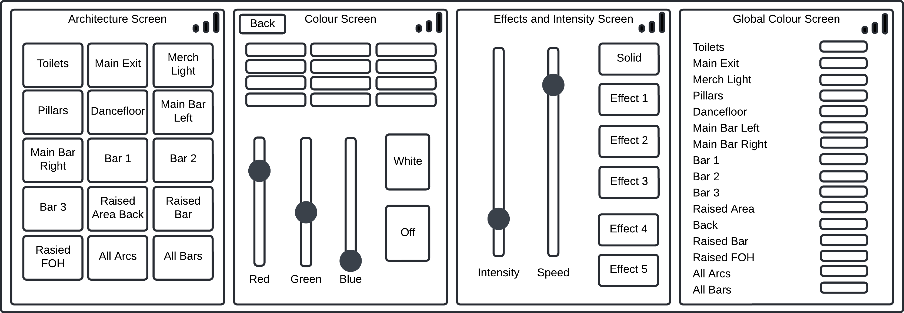
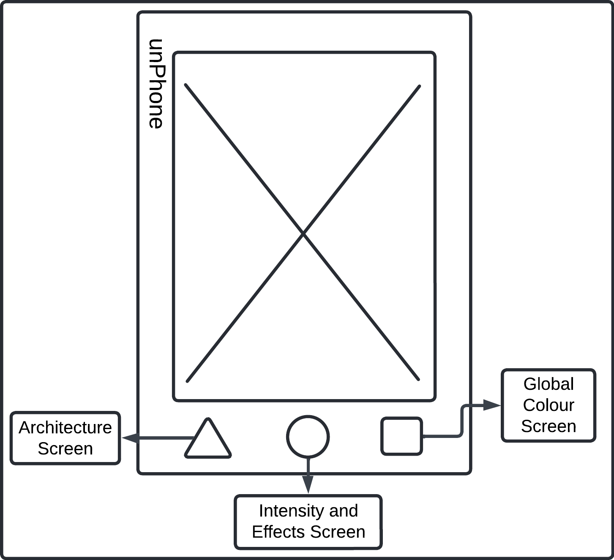
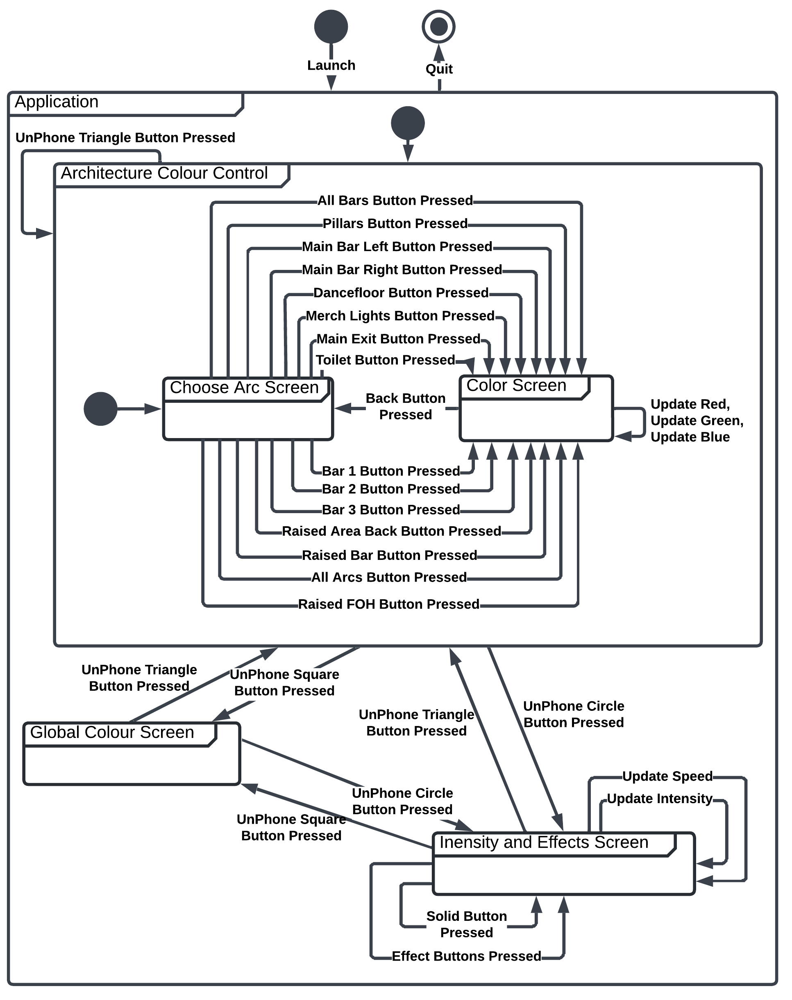
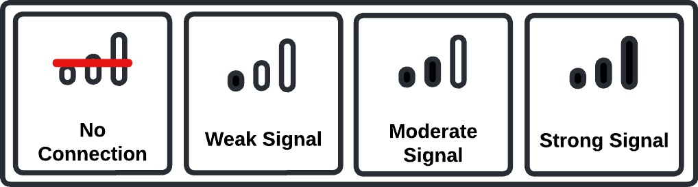
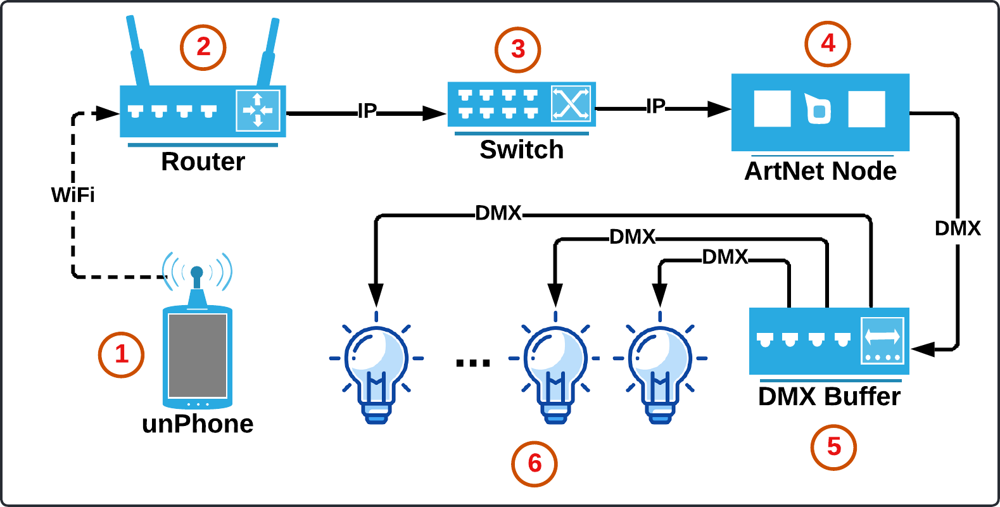
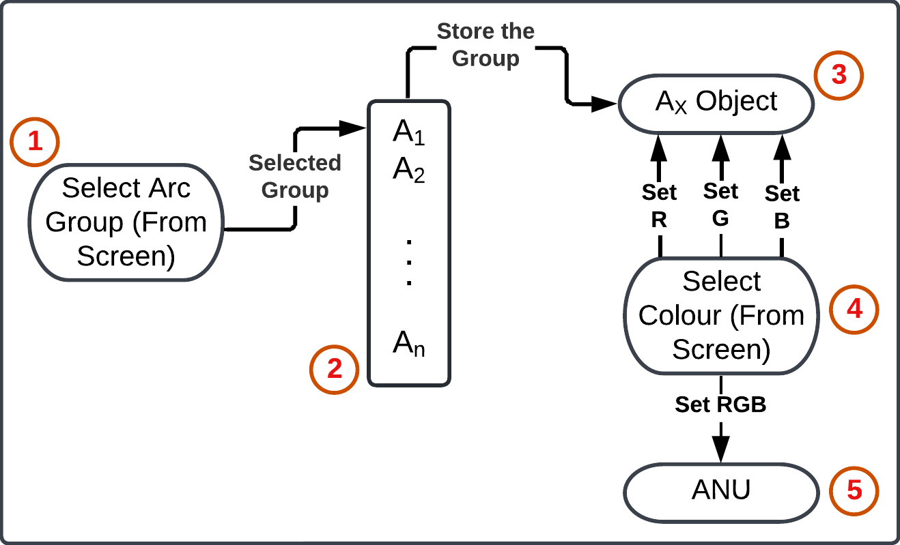
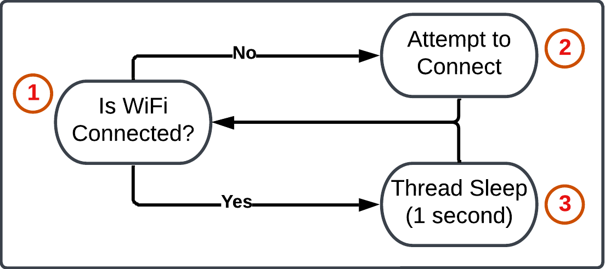
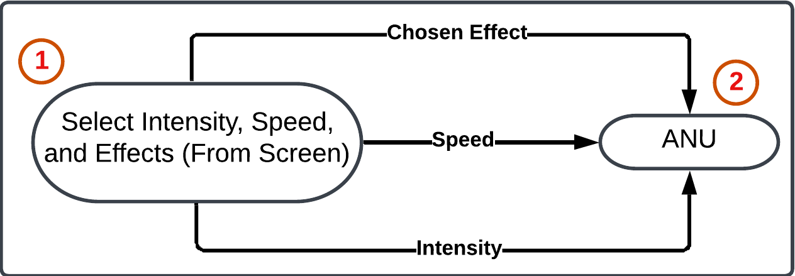
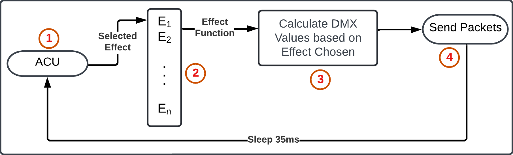
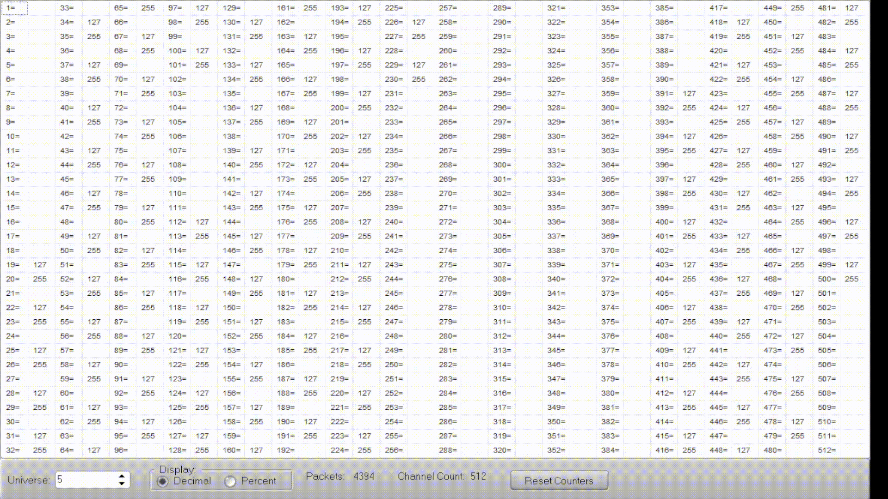

- Replace fixture_utils with architecture_utils or similar?
- Change UnPhone to unPhone?

---

# UnPhone Student Union Lighting Controller

[The Internet of Things](https://iot.unphone.net/) at [The University of Sheffield](https://www.sheffield.ac.uk/) (2024)

Project by Kush Bharakhada (kbharakhada1@sheffield.ac.uk) and Alex Chapman (achapman5@sheffield.ac.uk)

## Table of Contents  
- TODO - Complete this table of contents once documentation is complete.
- [Project Description](#project-description)  
- [Permissions](#light-control-permissions)  

## Project Description

The objective of this project has been to control the LED lighting strips around the Foundry live events venue within the [Student Union](https://su.sheffield.ac.uk/), employing a variety of effects and colours, all managed by the [UnPhone](https://unphone.net/). Currently, the lighting system relies on dedicated software called [ChamSys](https://chamsyslighting.com/), and a computer interface, which provides additional complexity for individuals without specialised knowledge in lighting engineering. With our approach, the user has the ability to use the UnPhone to select an architecture (LED group) and control their colours and effects easily. While our project may offer less flexibility compared to the conventional lighting control, its simplicity provides users with a variety of features tailored for events and occasions.

## Light Control Permissions

Permission was requested and granted from the Tech Services Department for access to its lighting system, allowing the project to undergo live testing and visualisation of its performance.

## Project Equipmment

The following equipment has been utilised for this project:

- [UnPhone](https://unphone.net/);
- WiFi Router;
- [Enttec Storm 8 Artnet Node](https://cdn.enttec.com/pdf/assets/70056/70056_STORM_8_USER_MANUAL.pdf);

## Design

### Application Features

| Feature | Description |
| ------------------------------------------------- | ------------------------------------------------------------------------------------------------------------------------------------------------------------------------------------------------------------------------------------------------------------------------------------- |
| Choosing an Architecture | Allow the user to choose which architecture (LED group) they would like to change the colour for. The architectures must be pre-defined and the user must be able to easily press the architecture which they would like to control. |
| Default Colour Options | When an architecture is selected, the user must be provided an array of default colour options to choose from and set the lights to.|
| RGB Colour Faders | For more flexible colour options, the user must have the ability to set RGB colours using faders (sliders). There must be three faders. For user experience, if a default colour option is chosen, the RGB faders must automatically update and set to the corresponding RGB levels.|
| Switching Lights OFF | The user must be given the ability to turn the lights OFF, individually for each architecture.|
| Default Effects | Allow the user to visualise lighting animations, from a pre-defined, set of effects.|
| Intensity and Speed | Provide the user with the ability to utilise faders to control the speed of effects and the lighting intensity. |
| Global Colour View | For a global view of colours, the user must be able to visualise every single architecture and its currently set colour on one screen. 
| UnPhone Buttons (Triangle, Circle and Square) | UnPhone will be utilised for navigation. Therefore, there must be three main screens architecture selection, setting effects and intensity, and global colour view. Setting a colour must be navigated to via the architecture screen. |

### Architecturals

An architecture is a group of individually controllable LED fixtures that are placed in key spots around the [Foundry venue](https://foundrysu.com/).
The Architecturals as a whole are primarly used during clubnights, gigs and corporate events for accented lighting. A prime example being the [St. Patick](https://en.wikipedia.org/wiki/Saint_Patrick%27s_Day) Day clubnight in which they were set to a mix of green, white and orange colours.

For the purpose of this project, the Architecturals were split into groups based on their locations within the venue:

| Architecture       | Number of Lights in Group |
| -------------------| ------------------------- |
| Toilets            | 17                        |
| Main Exit          | 11                        |
| Merch Lights       | 3                         |
| Pillars            | 4                         |
| Dancefloor         | 32                        |
| Main Bar Left      | 18                        |
| Main Bar Right     | 15                        |
| Bar 1              | 1                         |
| Bar 2              | 1                         |
| Bar 3              | 1                         |
| Raised Area Back   | 28                        |
| Raised Bar         | 19                        |
| Raised FOH         | 13                        |
| All Arcs           | 157                       |
| All Bars           | 3                         |

### Default Colour Options

The default colours the user can select from have been decided from the [12 colour wheel](https://en.wikipedia.org/wiki/Color_wheel#:~:text=The%20typical%20artists'%20paint%20or,%2Dblue%20and%20blue%2Dgreen.), as illustrated below. This presents the user with a sufficient number of default colours as well as the ability to create custom colours using RGB faders.

|       | Red | Rose | Magenta | Violet | Blue | Azure | Cyan | Aquamarine | Green | Chartreuse | Yellow | Orange |
| ----- | --- | ---- | ------- | ------ | ---- | ----- | ---- | ---------- | ----- | ---------- | ------ | ------ |
| **R** | 255 | 255  | 255     | 127    | 0    | 0     | 0    | 0          | 0     | 127        | 255    | 255    |
| **G** | 0   | 0    | 0       | 0      | 0    | 127   | 255  | 255        | 255   | 255        | 255    | 127    |
| **B** | 0   | 127  | 255     | 255    | 255  | 255   | 255  | 127        | 0     | 0          | 0      | 0      |

### Lighting Effects

For each of the effects below, the intensity fader acts as a maximum brightness that any effect can go.

| Effect Name  | Description                                                                             |
| -------------| ----------------------------------------------------------------------------------------|
| Solid        | Keeps the lights at a solid intensity                                                   |
| Pulse        | Pulses all the architecturals on and off in unison over time                            |
| Odd-Even     | Pulses all the architecturals on and off, with the odd and even fixtured being inverted |
| Fade Swipe   | Has the intensity of the fixtures slowly fade off as it moves around the room           |
| Binary Swipe | Has the intensity of the fixtures snap off as it moves around the room                  |
| Bars Fade    | Has the intensity of the bars fixtures slowly fade off as it moves around the room      |

### User Interface

**The user interface must be:**

- Simple and easy to use.
- Large enough buttons to prevent misclicks.
- Contrasting text against background for accessability.
- Large enough text for ease of readability.

**The application will consist of four main screens:**

| Screen | Navigation | Description | Interactive Screen |
| ---------------------------- | ------------------------ | --------------------------------------------------------------------------------------------------------------------------------------------------- | ------------------ |
| Architecture Screen | Physical Triangle Button | Presents the user with buttons to choose an architecture that they would like to change the colours for. | YES |
| Colour Screen | From Architecture Screen | Presents the user with default colour options as well as RGB faders for custom colours. | YES |
| Effects and Intensity Screen | Physical Circle Button | Presents the user with two faders; intensity of lighting and speed of effects. Furthermore, buttons will be presented for various lighting effects. | YES |
| Global Colour Screen | Physical Square Button | Presents the user with all architectures with their current lighting colours (black if the corresponding architecture is OFF). | NO |

**Wireframes illustrating the designs of the screens:**

**Diagram illustrating the connection and navigation between different screens:**

As presented in the diagram below, three screens can be navigated to using the physical UnPhone buttons. These can be navigated to regardless of the current screen the user is on. To enter the colour screen, the user must press the architecture that requires its colour to be changed. The user can then navigate back to the architecture screen by pressing **Back** or the UnPhone triangle button.

**Signal Strength Bars and WiFi Connection**

The signal strength between the WiFi router and the UnPhone is illustrated by signal bars which updates
live on the screen, periodically checking every 5 seconds. This provides the user with guidance if
they are connected to the router, otherwise the lights cannot be controlled.

### Networking and Backend

**Hardware system wiring diragram**
The signal path is as follows:
1. [Art-net](https://art-net.org.uk/) packets are sent from the unphone to the Router(2)
2. The packets are then forwarded from the Router(2) to the network Switch(3) to allow for multiple connections to the [Art-net node](https://art-net.org.uk/)(4)
3. The [Art-net node](https://art-net.org.uk/)(4) then converts the [Art-net](https://art-net.org.uk/) to [DMX](https://en.wikipedia.org/wiki/DMX512) and sends it to a [DMX buffer](https://www.enlx.co.uk/hire/lighting/control/chauvet-data-stream-4-dmx-buffer)(5)
4. Lastly, the DMX signal is split out of the [DMX buffer](https://www.enlx.co.uk/hire/lighting/control/chauvet-data-stream-4-dmx-buffer)(5) and send to the lighting fixtures(6) for control

**The processs that run on core 1 of the esp32**

**The process that run on core 2 of the esp32**

TODO - Diagram and a paragraph illustrating how the UnPhone interacts with the lights (a networking diagram).

Text

Text

## Implementation

### UnPhone to NuPhone

This project utilises the following features from the UnPhone:

- LCD Touch Display;
- UnPhone's three physical buttons (triangle, circle, and square);
- WiFi;
- Battery Power Supply;

To fully grasp an understanding of the [UnPhone library](https://gitlab.com/hamishcunningham/unphonelibrary), a new library (inspired from UnPhone) was created that was simplified and tailored specifically for our project. Therefore, only the features used have been implmented, and no others. One of the challenges encountered was initiating the backlight. Through research and comprehension of the UnPhone library, we successfully initialised the TCA9555 chip and transmitted to it via Wire, enabling the UnPhone backlight functionality.

### Libraries Used

| Library | Function |
|---------|----------|
|[Arduino](https://github.com/espressif/arduino-esp32/blob/master/cores/esp32/Arduino.h)|Standard Arduino library.|
|[stdint](https://cplusplus.com/reference/cstdint/)|For fundamental and extended integral types e.g. uint8_t.|
|[WiFi](https://github.com/espressif/arduino-esp32/blob/master/libraries/WiFi/src/WiFi.h)|WiFi connection.|
|[Wire](https://github.com/espressif/arduino-esp32/blob/master/libraries/Wire/src/Wire.h)|TCA chip communication.|
|[XPT2046_Touchscreen](https://github.com/PaulStoffregen/XPT2046_Touchscreen)|Touchscreen control.|
|[lvgl](https://lvgl.io/)|Graphics library.|
|[ArtnetWifi](https://www.arduino.cc/reference/en/libraries/artnetwifi/)|Transmitting Art-Net frames.|

### User Interface and LVGL

#### LVGL Header File and its C++ Implementation

The user interface has been created in [LVGL](https://lvgl.io/), providing a clear and simplistic design. For consistency and a DRY approach, functions were implemented to easily create buttons, sliders, and labels with custom styling attributes provided as parameters. The main setup for LVGL and the LCD touch display were acquired from the [Demo Examples](https://gitlab.com/hamishcunningham/unphonelibrary/-/tree/main/examples/lvgl-demo?ref_type=heads). The general properties and understanding of the LVGL widgets was achieved by experimenting with the [LVGL Widget Examples](https://github.com/lvgl/lvgl/tree/master/examples) in source code, and reading its [documentation](https://docs.lvgl.io/master/intro/index.html) for further customisations.

#### Screen Switching Logic

Each screen is created using [LVGL screen object](https://docs.lvgl.io/master/widgets/obj.html). By tracking the current screen with an integer, it makes it possible to delete the previous screen when the user switches to a new screen. Most of the screens require displaying information that was previously updated, therefore these screens need to be re-rendered. Individual components could be rendered and storing components which remain static on the screen, however this quickly increased the complexity of the application. By deleting the previous screen, and only rendering when the user visits, can save a small amount of memory. Rendering the screen is also instant. Furthermore, the screen switching logic prevents the user from spam rendering the current screen by checking the current screen before switching.

#### User Interface Screenshots

## Testing

**LVGL GUI Testing**

The GUI was tested by following the transition diagram described in the User interface section, ensuring all screens
transitioned to the desired state when either the touchscreen or unPhone buttons were pressed. 

**WiFi Testing**

The signal indicator at the top right of the screen is persistant accross all pages and indicates there current signal strenth and status. This was tested by connecting the unPhone to a mobile phone hotspot and increasing the distance between them to see changes to the signal indicator. The hotspot was then turned off to visualise the no connection symbol.

**Please Rename this Header Alex**

## Future Work
With the originality of this project, it provides plenty of opportunities to extend on the current progress, the prioritised future features are listed below:

1. **Colour Effects:**  As all of the fixtures are RGB, one of the next additions would be color effects, this would allow for the color slowly change over time or a rainbow pattern go round the room. It would be perfect for events such as the [St. Patick](https://en.wikipedia.org/wiki/Saint_Patrick%27s_Day) clubnight where Green and Orange effects are expected.

2. **Concurrent Effects:** Currently, the system runs 1 effect over all the architectual groups, but with the addition of individual effects it would be possible to have some fixtures "solid on" whilst others changing brightness over time. 

3. **UnPhone as an Interface:** Becuase the Art-Net processing takes place on the unPhone, if there are any signal issues the effects will stop running. The addition of a second wired microcontroller could be used, doing the Art-Net processing locally whilst the unPhone acts as a remote interface. This would also allow for multiple unPhone remotes, 1 for each room if needed. 

4. **Multi-venue Control:** Although the Foundry venue is split into three rooms (Main-room, Studio, Fusion), only the Main-room is currently controllable due to WiFi signal concerns. However, with the use of multiple WiFi access-points it would be possible for the lighting remote to control all 3 rooms at once, allowing for a full venue control system. 

## Video Link

Link: 
