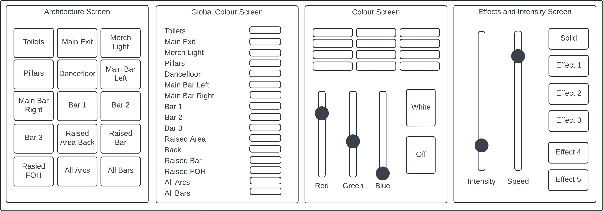
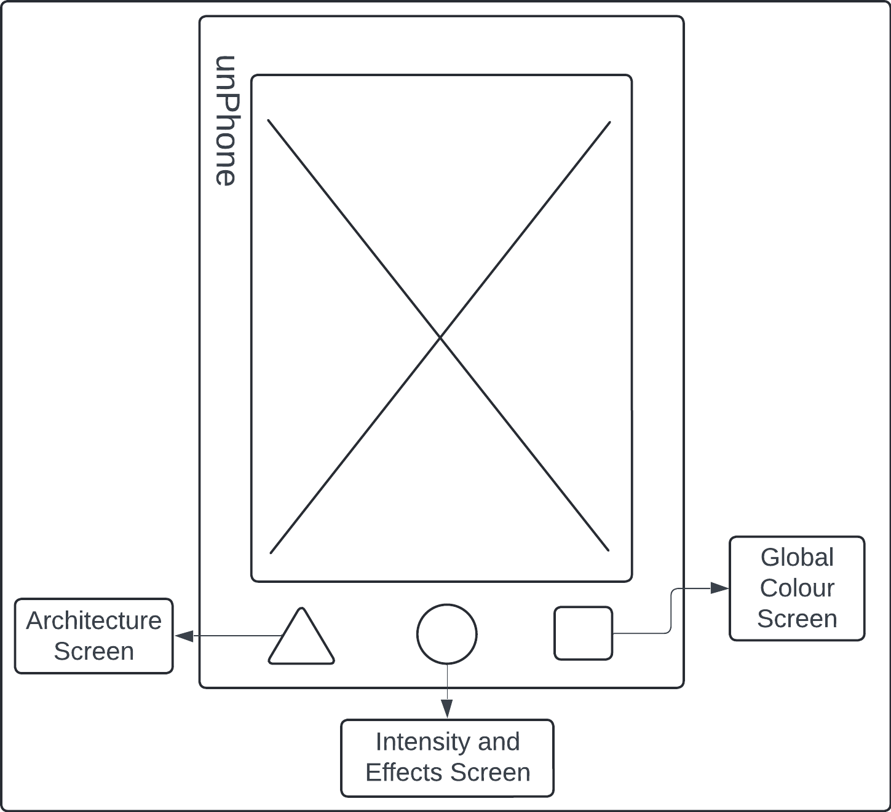
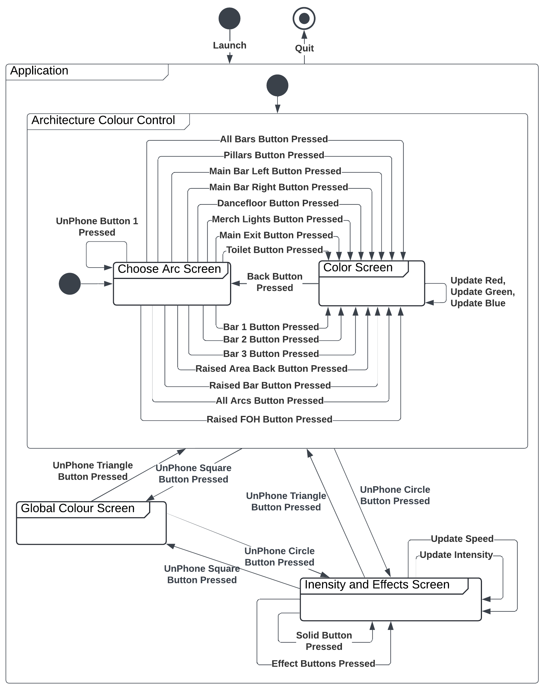

# UnPhone Student Union Lighting Controller

The Internet of Things [REF] at The University of Sheffield [REF] (2024)

Project by Kush Bharakhada (kbharakhada1@sheffield.ac.uk) and Alex Chapman (achapman5@sheffield.ac.uk)

## Table of Contents  
- [Project Description](#project-description)  
- [Permissions](#light-control-permissions)  

## Project Description

The objective of this project has been to control the LED lighting strips throughout different rooms in the Student Union [REF], employing a variety of effects and colours, all managed by the UnPhone [REF]. Currently, the lighting system relies on dedicated software and a computer interface, which provides additional complexity for individuals without specialised knowledge in lighting engineering. With our approach, the user has the ability to use the UnPhone to select an architecture (group of lights) and control their colours and effects easily. While our project may offer less flexibility compared to the conventional lighting control, its simplicity provides users with a variety of features tailored for events and occasions.

## Light Control Permissions

Permission was requested and granted from (the lighting people) for access to its lighting system, allowing the project to undergo live testing and visualisation of its performance.

## Project Equipmment

unphone led

## Design

### Application Features

| Feature | Description |
| ------------------------------------------------- | ------------------------------------------------------------------------------------------------------------------------------------------------------------------------------------------------------------------------------------------------------------------------------------- |
| Choosing an Architecture | Allow the user to choose which architecture (lighting group) they would like to change the colour for. The architectures must be pre-defined and the user must be able to easily press the architecture which they would like to control. |
| Default Colour Options | When an architecture is selected, the user must be provided an array of default colour options to choose from and set the lights to.|
| RGB Colour Faders | For more flexible colour options, the user must have the ability to set RGB colours using faders (sliders). There must be three faders. For user experience, if a default colour option is chosen, the RGB faders must automatically update and set to the corresponding RGB levels.|
| Switching Lights OFF | The user must be given the ability to turn the lights OFF, individually for an architecture.|
| Default Effects | Allow the user to visualise lighting animations, from a pre-defined, set of effects.|
| Intensity and Speed | Provide the user with the ability to utilise faders to control the speed of effects and the lighting intensity. |
| Global Colour View | For a global view of colours, the user must be able to visualise every single architecture and its currently set colour on one screen. 
| UnPhone Buttons (Triangle, Circle and Square) | UnPhone will be utilised for navigation. Therefore, there must be three main screens architecture selection, setting effects and intensity, and global colour view. Setting a colour must be navigated to via the architecture screen. |

### Architectures

(Alex please describe what architectures are and fill in the table below)

| Architecture | Number of Lights in Group |
| ------------ | ------------------------- |
| a            | i                         |
| b            | j                         |
| c            | k                         |
| d            | l                         |
| e            | m                         |
| f            | n                         |
| g            | o                         |
| h            | p                         |

### Default Colour Options

The default colours the user can select from have been decided from the 12 colour wheel, as illustrated below. This presents the user with a sufficient number of default colours as well as the ability to create custom colours using RGB faders.

|       | Red | Rose | Magenta | Violet | Blue | Azure | Cyan | Aquamarine | Green | Chartreuse | Yellow | Orange |
| ----- | --- | ---- | ------- | ------ | ---- | ----- | ---- | ---------- | ----- | ---------- | ------ | ------ |
| **R** | 255 | 255  | 255     | 127    | 0    | 0     | 0    | 0          | 0     | 127        | 255    | 255    |
| **G** | 0   | 0    | 0       | 0      | 0    | 127   | 255  | 255        | 255   | 255        | 255    | 127    |
| **B** | 0   | 127  | 255     | 255    | 255  | 255   | 255  | 127        | 0     | 0          | 0      | 0      |

### Lighting Effects

(Alex please fill in the table below)

| Effect Name | Description |
| ----------- | ----------- |
| a           | i           |
| b           | j           |
| c           | k           |
| d           | l           |
| e           | m           |
| f           | n           |
| g           | o           |
| h           | p           |

### User Interface

**The user interface must be:**
- Simple and easy to use.
- Large enough buttons to prevent misclicks.
- Contrasting text against background for accessability.
- Large enough text for ease of readability.

**The application will consist of four main screens:**

| Screen | Navigation | Description | Interactive Screen |
| ---------------------------- | ------------------------ | --------------------------------------------------------------------------------------------------------------------------------------------------- | ------------------ |
| Architecture Screen | Physical Triangle Button | Presents the user with buttons to choose an architecture that they would like to change the colours for. | YES |
| Colour Screen | From Architecture Screen | Presents the user with default colour options as well as RGB faders for custom colours. | YES |
| Effects and Intensity Screen | Physical Circle Button | Presents the user with two faders; intensity of lighting and speed of effects. Furthermore, buttons will be presented for various lighting effects. | YES |
| Global Colour Screen | Physical Square Button | Presents the user with all architectures with their current lighting colours (black if the corresponding architecture is OFF). | NO |

**Wireframes illustrating the designs of the screens:**

**Diagram illustrating the connection and navigation between different screens:**

As presented in the diagram, three screens can be navigated to using the physical UnPhone buttons. These can be navigated to regardless of the current screen the user is on. To enter the colour screen, the user must press the architecture that requires its colour to be changed. The user can then navigate back to the architecture screen by pressing **Back** or the UnPhone triangle button.

### Networking and Backend

Temporary text.

## Implementation

### UnPhone to NuPhone

This project utilises the following features from UnPhone:
- WiFi;
- UnPhone's three physical buttons (triangle, circle, and square);
- 
(Alex please add)

To fully grasp an understanding of the UnPhone library, a new library (inspired from UnPhone) was created that was simplified and tailored specifically for our project. Therefore, only the features used have been implmented, and no others. One of the challenges encountered was initiating the backlight. Through research and comprehension of the UnPhone library, we successfully initialised the TCA9555 chip and transmitted to it via Wire, enabling the UnPhone backlight functionality.

### User Interface and LVGL

#### LVGL Header File and its C++ Implementation

The user interface has been created in LVGL [REF], providing a clear and simplistic design. For consistency and a DRY approach, functions were implemented to easily create buttons, sliders, and labels with custom styling attributes provided as parameters. The main setup for LVGL and the LCD touch display were acquired from the Demo Examples [REF]. The general properties and understanding of the LVGL widgets was achieved by experimenting with the LVGL Widget Examples [REF] in source code, and reading its documentation [REF] for further customisations.

#### Screen Switching Logic

Each screen is created using LVGL objects [REF]. By tracking the current screen with an integer, it makes it possible to delete the previous screen when the user switches to a new screen. Most of the screens require displaying information that was previously updated, therefore these screens need to be re-rendered. Individual components could be rendered and storing components which remain static on the screen, however this quickly increased the complexity of the application. By deleting the previous screen, and only rendering when the user visits, can save a small amount of memory. Rendering the screen is also instant. Furthermore, the screen switching logic prevents the user from spam rendering the current screen by checking the current screen before switching.

#### User Interface Screenshots

Images of final GUI go here.

### Libraries Used

Temporary text.

#### Testing

Temporary text.

